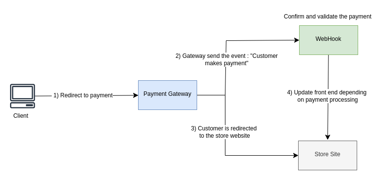

## 💰  PayHook

##### Project demo video, [here](https://youtu.be/Z1VX9dBI77s).

### 📌 Description

The project aims to integrate a payment gateway into an existing web commerce system. 

The chosen gateway uses a Webhook-based architecture, where a POST request with payment details is automatically sent to a configured webhook URL upon payment confirmation (e.g., via PayPal or MercadoPago).

> [!NOTE]
> 
> A webhook is a communication mechanism between systems that allows one server to automatically notify another when a specific event occurs, eliminating the need for constant polling. Technically, it is an HTTP request (usually POST) sent to a preconfigured endpoint triggered by an event.
>




#### Valid Payload example

```bash
{ 
  "event": "payment_success",
  "transaction_id": "abc123",
  "amount": "49.90",
  "currency": "BRL",
  "timestamp": "2025-05-11T16:00:00Z" 
}  
```

#### Invalid Payload example

```bash
{ 
  "event": "payment_cancelled",      # Wrong event
  "transaction_id": "abc123",        # If not already registered in db, is ok
  "amount": "0.0",                   # Amount < 0
  "currency": "BRLS",                # currency.size != 3
  "timestamp": "2025-05-11T16:00:00Z" 
}  
```

See more ,about the validation rule, on file `src/main/scala/server/script/validato/Validator.scala`).


#### Webhook responses
Expected handling by the webhook :

| Transaction Condition          | Return Status | Observation                                                   |
|--------------------------------|---------------|---------------------------------------------------------------|
| Valid transaction              | 200           | Make a request to the `/confirmar` route                      |
| Contains incorrect information | 400           | Cancel the transaction by making a request to the `/cancelar` |
| Missing information            | 400           | Cancel the transaction by making a request to the `/cancelar`                    |
| Invalid token                  | -             | This is a fake transaction and should be ignored              |


### ⚙️ Dependencies

#### Install Scala and Package Manager

**SBT** native packager lets you build application packages in native formats and offers different archetypes for common configurations, such as simple Java apps or server applications.

```bash
# Linux/Debian
$ echo "deb https://repo.scala-sbt.org/scalasbt/debian all main" | sudo tee /etc/apt/sources.list.d/sbt.list
$ curl -sL "https://keyserver.ubuntu.com/pks/lookup?op=get&search=0x99E82A75642AC823" | sudo apt-key add
$ sudo apt update
# Install Java (sbt dependencie) : 
# $ sudo apt install openjdk-17-jdk
$ sudo apt install sbt
```

```bash
# Create a sbt project
$ sbt new scala/scala-seed.g8
```

See more, [here](https://www.scala-sbt.org/sbt-native-packager/introduction.html)

### 🚀 Run Project

#### Test Webhook API using Swagger
```bash
$ cd webhook/
$ sbt clean compile
$ sbt run
```

Access url http://localhost:8080/docs and try it out !

> [!WARNING]
>
> In the code, the **StoreSite** object (`src/main/scala/server/script/store_site/StoreSite.scala`) makes a request to a confirmation and cancellation API that is only available when we run the Python test.
> 
> When running the tests via the Swagger interface, comment lines : 
> ```bash
> # File : src/main/scala/server/script/business/Business.scala
> ...
> // Comment line to use Swagger UI:
> StoreSite.post(payload, StoreSite.confirmationRoute);
> ...
> 
> // Comment line to use Swagger UI:
> StoreSite.post(payload, StoreSite.cancellationRoute);
> 
> ...
> ```
> ```bash
> # File : src/main/scala/server/Routes.scala
> ...
> // Comment line to use Swagger UI:
> StoreSite.post(body, StoreSite.cancellationRoute)
> 
> ...
>```


#### Run Python Tests

```bash
# Install Python tests requirements
$ cd webhook/
$ python3 -m venv venv
$ pip install -r requirements.txt

# Terminal 1
$ sbt clean compile
$ sbt run

# Terminal 2 
$ cd src/test/python/
$ python3 test_webhook.py
```

#### Check temporary data saved by webhook

First, install [sqlite3](https://www.tutorialspoint.com/sqlite/sqlite_installation.htm).

```bash
$ cd webhook/
$ sqlite3 src/main/scala/server/data/payment.db
   
sqlite> .tables
payment_table

sqlite> SELECT * FROM payment_table;
123|payment_success|29.9|BRL|teste
```


> [!NOTE]
> #### After a dependence add or update
> 
> Change on file `webhook/project/Dependencies.scala` and in `webhook/build.sbt` :
> 
> ```bash
> $ cd webhook/
> $ sbt reload
> $ sbt update
> ```

### References

1. [Swagger Akka Http](https://index.scala-lang.org/swagger-akka-http/swagger-akka-http)
2. [Akka Server Side](https://doc.akka.io/libraries/akka-http/current/server-side/index.html)
3. [Akka HTTP Sample](https://github.com/pjfanning/swagger-akka-http-sample/tree/main)
4. [Scala SQL Client with Slick](https://medium.com/rahasak/sqlite-scala-client-with-slick-8b122b334b39)
5. [Scalasql Example](https://github.com/com-lihaoyi/scalasql/blob/main/scalasql/test/src/example/SqliteExample.scala)
6. [Akka HTTP - Server HTTPS Support](https://doc.akka.io/libraries/akka-http/current/server-side/server-https-support.html)

<br>

<div align="center">

**@2025, Insper**. 10° Semester, Computer Engineering.

_Funcional Programming Discipline_

</div>